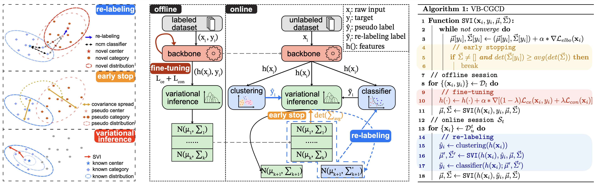

<div align="center">

<h2>Continual Generalized Category Discovery:

Learning and Forgetting from a Bayesian Perspective</h2>

[Hao Dai](https://github.com/daihao42), [Jagmohan Chauhan](https://sites.google.com/view/jagmohan-chauhan/home)

University College London

University of Southampton

[](LICENSE)

</div>
<div align="center">

</div>

## Usage

### Installation

```
conda create -n vbcgcd python=3.12.2
conda activate vbcgcd
pip install -r requirements.txt
mkdir datasets
```

## Prepare Datasets

```
python feature_extractor/dino-cifar100.py --finetuned --output_dir datasets/cifar100
```

For GC10-DET, download and extract the Kaggle dataset first:

```
kaggle datasets download -d alex000kim/gc10det -p datasets/raw/gc10det --unzip
python feature_extractor/dino-gc10det.py --dataset_path datasets/raw/gc10det --finetuned --output_dir datasets/gc10det
```

If you run from a Kaggle notebook or already have the dataset mounted, pass that extracted dataset folder directly:

```
python feature_extractor/dino-gc10det.py --dataset_path /kaggle/input/gc10det --finetuned --output_dir datasets/gc10det
```

## Training

```
python main.py --base 50 --increment 10 --pretrained_model_name dino-vitb16-sl --data_dir datasets/cifar100 --trail_name mix_increment_mngmm_dinovb16_sl_cifar_100
```

GC10-DET training:

```
python main.py --base 5 --increment 1 --pretrained_model_name dino-vitb16-sl --dataset gc10det --data_dir datasets/gc10det --num_classes 10 --num_dim 128 --trail_name mix_increment_mngmm_dinovb16_sl_gc10det
```

GC10-DET follows the same 50% labeled and 5-session protocol: 5 labeled classes, 1 novel class per online session, 80% of available train samples per class, and 20% known-class replay per session. The sample counts are computed from the extracted GC10-DET train split so imbalanced Kaggle class counts are handled safely.

## Citation

If you find our work useful, please cite our related paper:

```
# ICML 2025
@inproceedings{dai2025vbcgcd,
  title={Continual Generalized Category Discovery: Learning and Forgetting from a Bayesian Perspective},
  author={Dai, Hao and Chauhan, Jagmohan},
  booktitle={Proceedings of the 42nd International Conference on Machine Learning (ICML)},
  year={2025}
}

```
